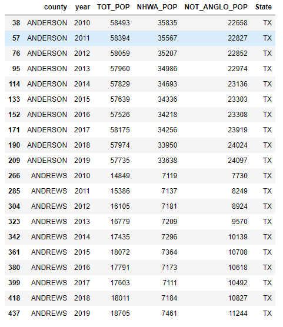
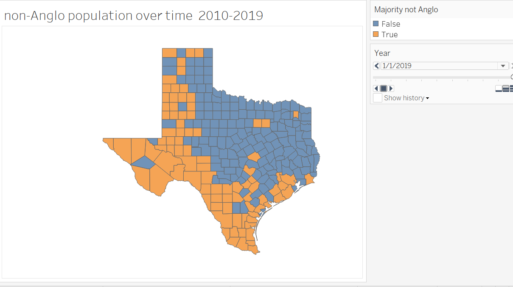
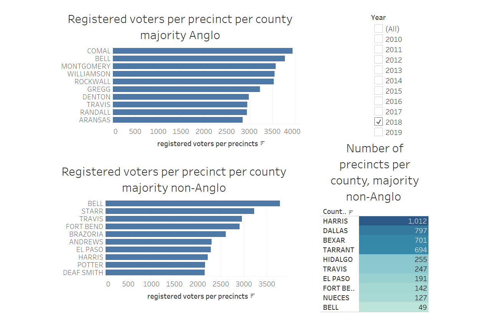

# Voting in TX 2010-2019

## Analysis of voting and registration data in TX from 2010 to 2019

## TABLE OF CONTENTS
*[Motivation](#motivation) 

*[Data](#data)

*[Analytical Approach](#analytical-approach) 

*[Tools Used](#tools-used) 

*[Sources](#sources)

*[Tableau Story](#tableau-story)

### Motivation 
Leading up to the 2020 presidential election there were many stories in the news cycle regarding voting access. I have always voted but feel like I could become a more engaged citizen and decided to make voting and voting rights the focus of my NSS capstone

### Data
I used data from the census bureau from 2010-2019
to explore demographics. The cleaning of that data was relatively simple and really involved removing many columns I didn't need. 

The other data source I used was registration data I took from the TX SOS website.  I needed to cut and paste it from their website and created individual tables that way before I joined all of the tables (organized by year) into one complete table.

an example of a table from my jupyter notebook:

With Tableau I made a map of TX showing the change ethnic/racial minority population over time

..then I worked to make different visualizations based on my analysis. below is my dashboard showing precinct data over time:

### Analytical Approach
Initially I worked (using the widest lense) to find ANY data I thought would be useful.  As my data sources multiplied I decided to narrow ths scope to TX.  If time had allowed I would have loved to expand my analysis to another state not included on the list of states needing to pass preclearance tests to use as a control.  Or I would like to go back and include a national comparison to some of my findings. Each state is different in their election procedures so there would be challenges there too. 

I attempted to compare the census data on race and ethnicity with voter registration data over the same years. I was looking for any examples of limiting access to voting by looking at 'suspense' voter classification and number of precincts in each county.  

### TOOLS USED

 tex_reg.csv started as 10 different tables that I needed to copy and paste directly from the TX Secretary of State website and then combined them using Python. All other cleaning of any data I explored was done in Python. 
- `Excel` -- I used Excel to examine my tables briefly before loading them into a jupyter notebook.

- `Python/Pandas` - for exploration, aggregation and some minor vizualization of the data

- `Tableau` - for creating interactive dashboard

- `Visual Studio Code` for editing html/markdown files

- `Git` for version control

### SOURCES

https://www.census.gov/data/tables/time-series/demo/popest/2010s-counties-detail.html

https://www.sos.state.tx.us/elections/historical/jan2018.shtml

### TABLEAU STORY

https://public.tableau.com/app/profile/tim.pearson/viz/TXVoting_16247578074990/TexasVotingAccess